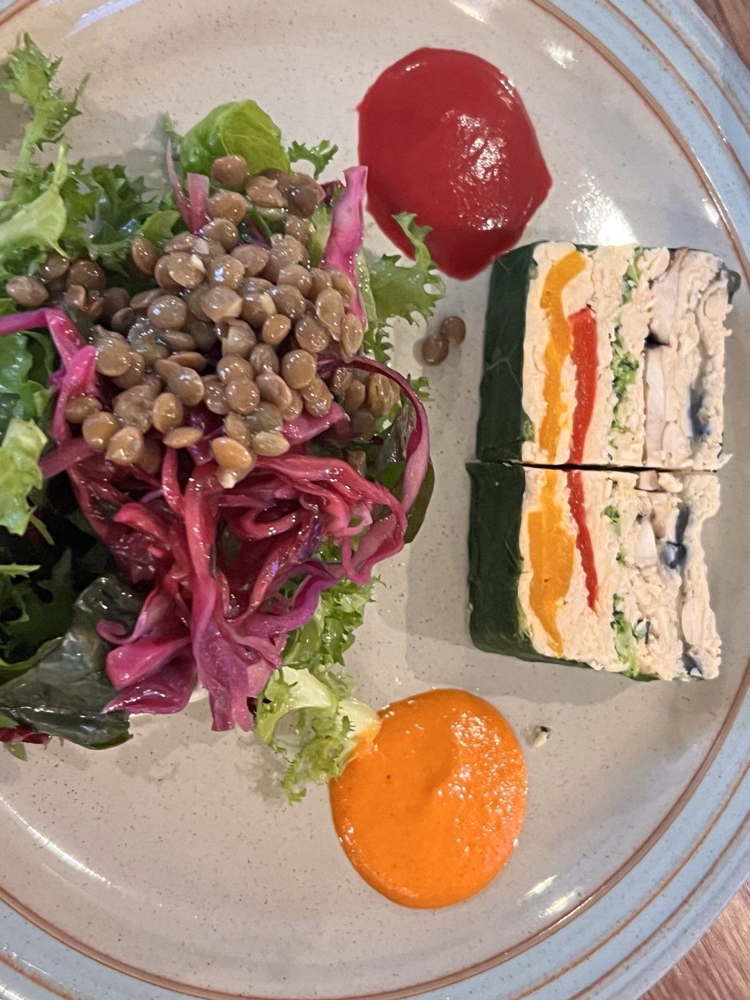

# 로컬릿

국적: 비건
별점: ★★★☆☆
위치: 서울특별시 성동구 한림말길 33, 2층
음식 타입: 비건, 양식
추천인: 민철 김
한줄평: 비건이라는 특성상 한번에 이해하기는 어렵다. 두 번 방문할 각오를 하셔라.

첫 메뉴부터 이들에게 솔직히 난해했다. 후무스는 먹어본 적 있는 이들이였지만 백태콩으로 만든 후무스는 쉽지 않았다. 야채들의 맛이 조화되는 무언가가 느껴지기는 했는데 무언가 이해가 되지 않는 맛이였다.

시금치 뇨끼는 개인적으로 나에게는 감칠맛에 부족하다고 느껴졌다. 평소 접하는 파스타에서는 소스를 낼 때 고기육수를 주되게 쓰거나 동물성 크림을 쓰다보니 그런듯 했다. 시금치를 뭔가 넣고 육수를 쓴 것 같기는 한데...... 많이 아쉬웠다.

비건 삼형제 중에서 호박 까넬로니는 그나마 이해할 수 있었다. 파스타 속 단호박과 당근 소스, 치즈의 조화가 괜찮게 다가왔다. 하지만 이미 두개의 메뉴에서 기대가 꺾인 두 남자들은 그냥저냥 먹었다. 평소의 나처럼 이거라도 이해해보라고 설명을 할 분위기가 아니였다.

라구 리가토니는 비건이 아닌 메뉴였다. 그래서 겁나 맛있었다. 그냥 해치웠다. 그래도 백수저의 클래스가 느껴지는 깊이였다.

암튼 두 남자는 난해한 메뉴를 먹었다. 그들의 첫 비건 식당 탐방은 물음표만을 잔뜩 남기고 끝났다. 그렇게 그들은 물음표를 떠안고 다른 무언가를 먹기 위해 동호대교를 걸었다.

그렇게 커손연 영문표기 논쟁은 시작되었다......

